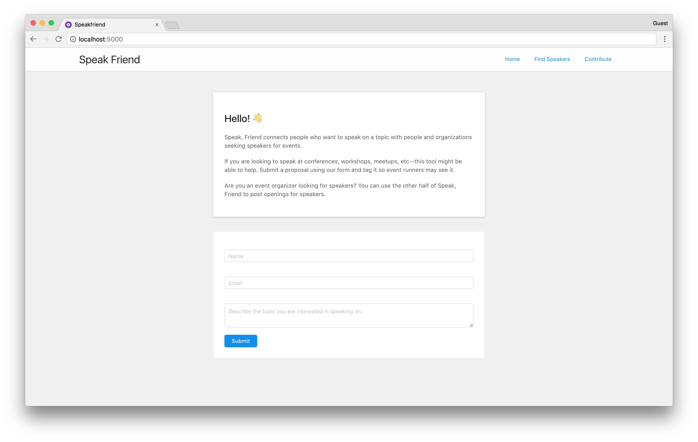

# speakfriend
[](#contributors)
[](http://makeapullrequest.com)

> Application to connect speakers and those who wants them to speak.

# About



SpeakFriend is a tool that wants to make it simpler, easier, and more pleasant to connect people speakers and those who can host speakers. 

If any terms / jargon in our application may appear confusing, please refer to our Terms section near the bottom of this document. 

# Using SpeakFriend

SpeakFriend is currently under development. While our code is constantly available for use as one may like; we cannot necessarily provide support for a product that is yet unfinished. We hope to perform a sort of versioned releases as we test the product out and have groupings of new features correspond to new releases.

# Contributing

Contributions are welcome. If you are interested in working on a feature, we recommend looking through the repo's issues. We gladly welcome bug fixes, although we'll need to have more features before the bugs arrive.

## Project Components

There are three parts to our application right now:

**Client**: This is the front end. It is written in Preact. 

**Api**: Our api is served by POST**GREST**. To run this you will need to download and install PostGREST. PostGrest is a neat tool that allows you to build a REST API right into Postgres. Instead of writing an API in the traditional sense, Postgres will hopefully be able to handle the majority of what we need. 

**DB**: Our db is in Postgres. As noted above, we hopefully will be writing some SQL / Postgrest sqlviews to make some cool api magic happen. 

## Setting up the project for development

There are a few steps to get setup on our stack; we are working to simplify this. The tools being used for this project might be a bit new / unconventional, but don't let that stop you from checking this out! You can also find @teesloane on the [TorontoJS slack](http://slack.torontojs.com/) if you have any questions; he try and help you out if he can.


1. [Download and install postgrest](https://postgrest.com/en/v4.1/install.html) (< instructions on the page linked )
  1.1 You will need to either put POSTGREST in your path, or _put it in the root folder of *SpeakFriend*_. On a mac for example, `brew install postgrest` will automatically put `postgrest` into your path.

2. We use docker to run our postgres database inside. You will need to [install docker](https://docs.docker.com/engine/installation/#supported-platforms) 

3. We have written a shell script that runs the installation for the project. If it fails for some reason you may need to install dependencies manually for each part of the stack; you can find out more about this by reading the comments in the Makefile. 

```sh
./install.sh
```

4. If everything went well, you can run the stack:

```sh
make start
```

5. You will need to seed our database with data / the schema that it needs. This needs to be integrated into our development environment setup (hint, if anyone wants to contribute to do so please do!!).

```sh
# open up a terminal and enter our database shell to add some data to it. 
make db_shell

# This will bring up a prompt like so:
============ entering the docker psql shell ================
docker exec -it speakfriend_db psql -U postgres
psql (9.6.3)
Type "help" for help.

postgres=#

# cool, now you can copy and paste some sql into the project. 
# Navigate to ./db/scratch.sql --> copy and paste the entire contents of that file into the postgres shell.
```

***

Note: you can run each part of the stack independently; for example, start the client with:

```sh
npm run start-client
```

7. Woo. You made it. This is a bit of a hefty start to get the project running; we will work on refining this setup as we progress; pull requests welcome!

# Contributors

Thanks goes to our contributors ([emoji key](https://github.com/kentcdodds/all-contributors#emoji-key)):

<!-- ALL-CONTRIBUTORS-LIST:START - Do not remove or modify this section -->
| [<br /><sub>Tyler</sub>](http://tylersloane.com)<br />[💻](https://github.com/speakfriend/speakfriend/commits?author=teesloane "Code") [📖](https://github.com/speakfriend/speakfriend/commits?author=teesloane "Documentation") [🔧](#tool-teesloane "Tools") | [<br /><sub>dann toliver</sub>](https://github.com/dxnn)<br />[💬](#question-dxnn "Answering Questions") [💻](https://github.com/speakfriend/speakfriend/commits?author=dxnn "Code") [📋](#eventOrganizing-dxnn "Event Organizing") [💡](#example-dxnn "Examples") [🚇](#infra-dxnn "Infrastructure (Hosting, Build-Tools, etc)") [👀](#review-dxnn "Reviewed Pull Requests") |
| :---: | :---: |
<!-- ALL-CONTRIBUTORS-LIST:END -->

This project follows the [all-contributors](https://github.com/kentcdodds/all-contributors) specification. Contributions of any kind welcome!
